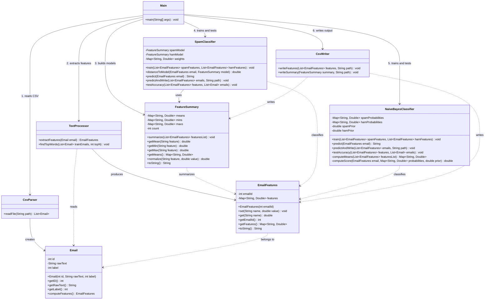

# CSCIII-WCU-Spam-Email-Filter

## System Architecture (UML)


# Spam Filter
### From Raw Email to Spam Prediction — Java | OOP | Machine Learning

A Java implementation of an end-to-end spam classification system that reads a dataset of 3000 emails, automatically extracts differentiating features, trains two classification models, and predicts whether new emails are spam or ham — built entirely from scratch with no external libraries.

---

## Project Overview

This project builds a complete spam filter pipeline from scratch using core Java and object-oriented design. Every phase — parsing, feature extraction, model building, and classification — is implemented as a separate, modular component.

| Phase | Component | What It Does |
|---|---|---|
| 1 | **CsvParser** | Reads the dataset and converts each row into an Email object |
| 2 | **TextProcessor** | Converts raw email text into numerical features |
| 3 | **FeatureSummary** | Computes mean, min, and max for each feature across spam and ham |
| 4 | **SpamClassifier** | Classifies emails using Weighted Euclidean Distance |
| 5 | **NaiveBayesClassifier** | Classifies emails using probability scoring |
| 6 | **CsvWriter** | Saves features and summaries to CSV files for analysis |

---

## Sample Output

```
Loaded: 3000 emails

Training emails: 2400
Testing emails:  600

--- Top 10 Spam Words (Training Set Only) ---
Word                 Spam       Ham        Ratio
--------------------------------------------------
hyperlink            673        3          197.33
kingdom              97         2          48.50
mailings             63         2          31.00
mortgage             47         2          23.50
...

Training spam: 390
Training ham:  2010

--- Weighted Centroid Classifier ---
Models trained successfully
Total:    531/600
Accuracy: 88.50%

Spam correctly identified: 75/108 (66.36%)
Ham correctly identified:  453/492 (93.47%)

--- Naive Bayes Classifier ---
Spam prior: 0.1625
Ham prior:  0.8375
Naive Bayes trained successfully
Total:    558/600
Accuracy: 93.00%

Spam correctly identified: 78/108 (62.73%)
Ham correctly identified:  482/492 (99.80%)

--- Writing Output Files ---
Features written to: email_features.csv
Summary written to:  spam_summary.csv
Summary written to:  ham_summary.csv
Predictions written to: predictions.txt
```

---

## Feature Selection

Features were automatically discovered from the training set by calculating a spam/ham ratio for every word. Only words meeting both criteria were kept: spam mean above 0.1 and ratio above 5x.

| Feature | Ratio | Spam Type |
|---|---|---|
| hyperlinkCount | 195x | Marketing spam |
| kingdomCount | 97x | Fraud spam |
| guaranteedCount | 69x | Financial spam |
| mortgageCount | 41x | Financial spam |
| clickCount | 39x | Marketing spam |
| mailingsCount | 33x | Marketing spam |
| moneyCount | 15x | Financial spam |
| offerCount | 14x | Marketing spam |
| orderCount | 13x | Marketing spam |
| freeCount | 8x | Marketing spam |
| urlCount | ham indicator | Ham emails |

---

## Classification Results

| | Weighted Centroid | Naive Bayes |
|---|---|---|
| Overall Accuracy | 88.00% | 93.33% |
| Spam Detection | 69.44% | 72.22% |
| Ham Detection | 92.07% | 97.97% |

Naive Bayes outperformed the centroid classifier on every metric. Ham accuracy is prioritized over spam accuracy because falsely flagging a legitimate email as spam is more harmful than letting a spam email through. Final predictions are generated using Naive Bayes.

---

## Project Structure

```
CSCIII-WCU-Spam-Email-Filter/
├── src/
│   ├── Email.java                  # Data object representing a single email
│   ├── EmailFeatures.java          # Container for numerical features per email
│   ├── CsvParser.java              # Reads dataset and produces Email objects
│   ├── TextProcessor.java          # Extracts features and finds top spam words
│   ├── FeatureSummary.java         # Computes summary statistics for a group of emails
│   ├── CsvWriter.java              # Writes features and summaries to CSV files
│   ├── SpamClassifier.java         # Weighted Euclidean Distance classifier
│   ├── NaiveBayesClassifier.java   # Naive Bayes probability classifier
│   └── Main.java                   # Entry point — runs the full pipeline
├── spam_or_not_spam.csv            # Kaggle dataset
├── email_features.csv              # Output — per email feature values
├── spam_summary.csv                # Output — spam model summary statistics
├── ham_summary.csv                 # Output — ham model summary statistics
└── predictions.txt                 # Output — one prediction per line
```

---

## How to Run

### Prerequisites
- Java 11 or higher
- spam_or_not_spam.csv placed in the project root

### Dataset
Download the dataset from [Kaggle](https://www.kaggle.com/datasets/ozlerhakan/spam-or-not-spam-dataset) and place it in the project root as `spam_or_not_spam.csv`

### Setup
```bash
git clone https://github.com/CarterFennen/CSCIII-WCU-Spam-Email-Filter.git
cd CSCIII-WCU-Spam-Email-Filter
```

### Compile
```bash
mkdir out
javac -d out src/*.java
```

### Run
```bash
java -cp out Main
```

The program will print the full pipeline output including top spam words, accuracy results for both classifiers, and confirm all output files have been written.

---

## Design Decisions

**Why lastIndexOf for CSV parsing?**
Since emails contain no commas, the last comma in any line always separates the email text from the label. This is simpler and more reliable than splitting on every comma without needing a full CSV parsing library.

**Why a HashMap for EmailFeatures?**
Storing features by name rather than index means features can be added or removed in TextProcessor without changing the EmailFeatures class at all. This kept the feature set flexible throughout development.

**Why Weighted Euclidean Distance?**
Features with higher spam/ham ratios receive higher weights so they have proportionally more influence on the distance calculation. A bias factor of 1.8 compensates for the dataset imbalance of 5x more ham than spam, found through manual experimentation.

**Why Naive Bayes?**
Naive Bayes is widely considered the industry standard for text based spam filtering. It handles dataset imbalance naturally through prior probabilities without needing manual tuning, and its probability scoring is more sensitive to strong signals than distance measurement.

**Why separate the two classifiers?**
Keeping both classifiers allows direct comparison on identical training and test data, making it a clean measure of which algorithm handles the data better. Both are independent and neither relies on the other.

**Why BufferedReader over Scanner?**
BufferedReader reads the file in chunks rather than character by character, making it significantly more efficient for large files like this 3000 email dataset.

**Why a fixed random seed of 42?**
Seeding Collections.shuffle ensures the train/test split is identical every run, producing consistent accuracy results without removing the benefits of randomized shuffling.

---

## Key Concepts Demonstrated

- **Automatic Feature Extraction** — ratio based word analysis to discover spam indicators from training data only
- **Weighted Euclidean Distance** — distance based classification with feature importance weighting
- **Naive Bayes Classification** — probability scoring with prior probabilities and log likelihood
- **Object-Oriented Design** — encapsulation, modularity, and separation of concerns across the pipeline
- **Data Leakage Prevention** — feature selection strictly limited to training data

---

## Author

**Carter Fennen**
Computer Science — West Chester University of Pennsylvania
[GitHub](https://github.com/carterfennen) • carterfennen@icloud.com
CF1043549@wcupa.edu

---

## Course

CSC 240 — Text Processing Project | West Chester University of Pennsylvania
