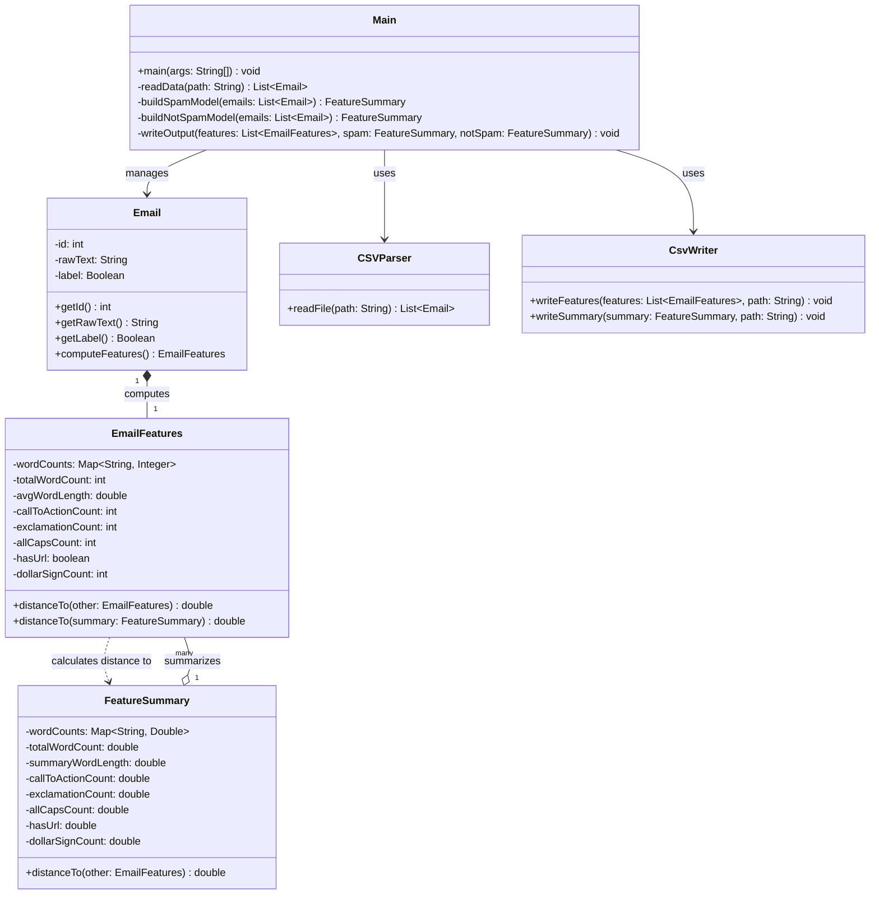

# CSCIII-WCU-Spam-Email-Filter

##System Architecture (UML)

```mermaid

classDiagram
    class Main {
        +main(args: String[]) void
        -readData(path: String) List~Email~
        -buildSpamModel(emails: List~Email~) FeatureSummary
        -buildNotSpamModel(emails: List~Email~) FeatureSummary
        -writeOutput(features: List~EmailFeatures~, spam: FeatureSummary, notSpam: FeatureSummary) void
    }

    class Email {
        -id: int
        -rawText: String
        -label: Boolean
        +getId() int
        +getRawText() String
        +getLabel() Boolean
        +computeFeatures() EmailFeatures
    }

    class EmailFeatures {
        -wordCounts: Map~String, Integer~
        -totalWordCount: int
        -avgWordLength: double
        -callToActionCount: int
        -exclamationCount: int
        -allCapsCount: int
        -hasUrl: boolean
        -dollarSignCount: int
        +distanceTo(other: EmailFeatures) double
        +distanceTo(summary: FeatureSummary) double
    }

    class FeatureSummary {
        -wordCounts: Map~String, Double~
        -totalWordCount: double
        -summaryWordLength: double
        -callToActionCount: double
        -exclamationCount: double
        -allCapsCount: double
        -hasUrl: double
        -dollarSignCount: double
        +distanceTo(other: EmailFeatures) double
    }

    class CSVParser {
        +readFile(path: String) List~Email~
    }

    class CsvWriter {
        +writeFeatures(features: List~EmailFeatures~, path: String) void
        +writeSummary(summary: FeatureSummary, path: String) void
    }

    %% Relationships
    Main --> CSVParser : uses
    Main --> CsvWriter : uses
    Main --> Email : manages
    Email "1" *-- "1" EmailFeatures : computes
    FeatureSummary "1" o-- "many" EmailFeatures : summarizes
    EmailFeatures ..> FeatureSummary : calculates distance to

```
